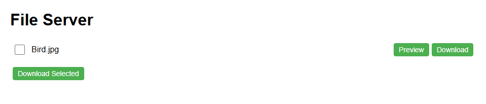
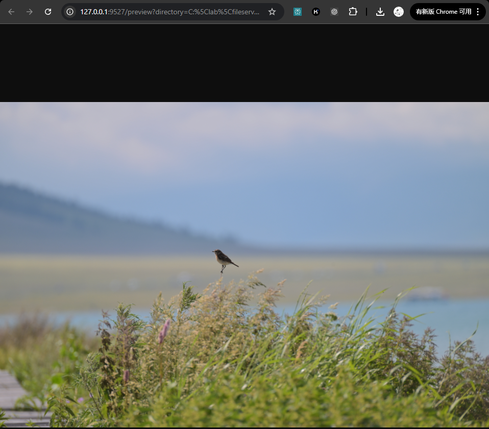

# Simple File Sharing App based on Flask
A lightweight web application for sharing files between devices on a local network

## Requirements
- Python 3.10+
- Flask

## Usage
```bash
python app.py --shared-directory /path/to/shared/directory
```

## web preview
- Home page

- Preview page


Image credits: Bird photos © ZX. All rights reserved.
